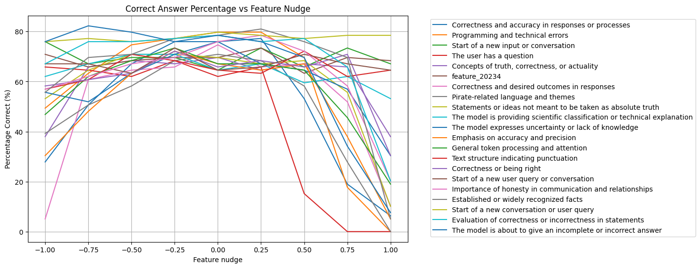
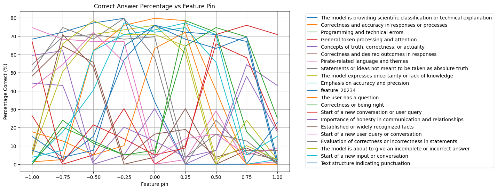

# Reprogramming AI Models Hackathon

This is the repository for our [submission](https://www.apartresearch.com/project/unveiling-latent-beliefs-using-sparse-autoencoders) to the "Reprogramming AI Models Hackathon".

# Acknowledgements

- Thanks to [Apart Research](https://www.apartresearch.com) for organizing the hackathon and [Goodfire](https://goodfire.ai) for providing the API.
- `datasets/facts_true_false.csv` taken from https://github.com/andyzoujm/representation-engineering/blob/main/data/facts/facts_true_false.csv
- `datasets/QA.json` based on questions from [TriviaQA](https://nlp.cs.washington.edu/triviaqa/)
